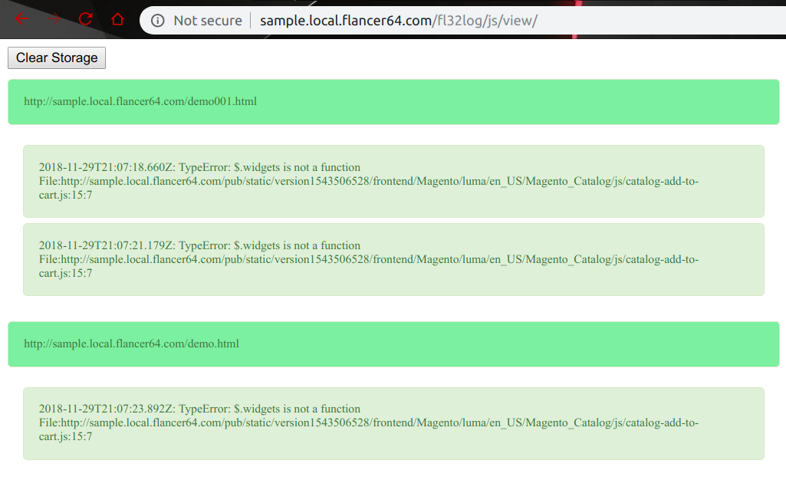
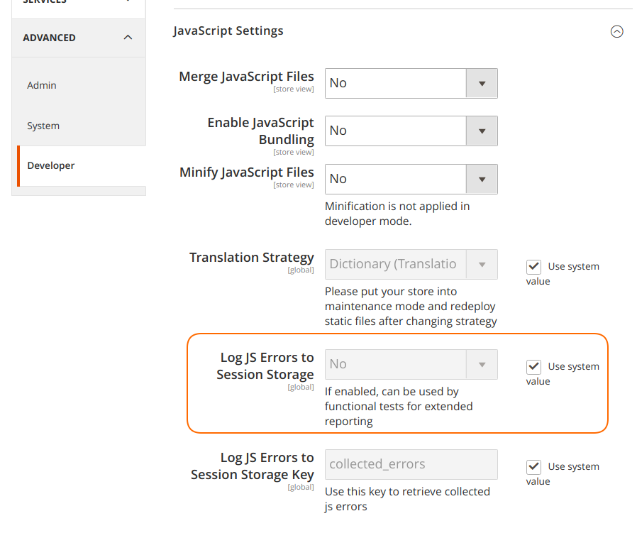
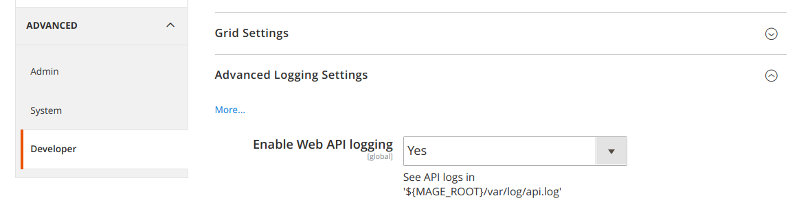

# mage2_ext_log_api

Add ability to log:

* REST API requests/responses to server side logs.
* client side JS errors to browser's local storage (with ability to display these errors on the special page).

Compatible Magento versions: **2.2.x, 2.3.x**.


### REST API Sample

See logs in `${MAGE_ROOT}/var/log/api.log`:

```log
2018-09-05 15:08:57-API.INFO - Route: '/rest/ru/V1/guest-carts/fe9cf0d8828fcb219484b39c12b8cdb7/estimate-shipping-methods' => '/V1/guest-carts/fe9cf0d8828fcb219484b39c12b8cdb7/estimate-shipping-methods'
2018-09-05 15:08:57-API.INFO - Request: {"address":{"region_id":null,"country_id":"US","postcode":null},"cartId":"fe9cf0d8828fcb219484b39c12b8cdb7"}
2018-09-05 15:08:57-API.INFO - Response 'Magento\Quote\Api\GuestShipmentEstimationInterface::estimateByExtendedAddress()': [{"carrier_code":"flatrate","method_code":"flatrate","carrier_title":"Flat Rate","method_title":"Fixed","amount":2000,"base_amount":2000,"available":true,"error_message":"","price_excl_tax":2000,"price_incl_tax":2000}]
```


### Frontend Sample

Go to `http://.../fl32log/js/view/`:




## Module Configuration


### Disable "Log JS Errors to Session Storage"

See `Store / Configuration / Advanced / Developer / JavaScript Settings / Log JS Errors to Session Storage`:



This logging is used for Magento tests and is disabled by default.

Attention: section `Store / Configuration / Advanced / Developer` is available in `developer` mode only:

```bash
$ ./bin/magento deploy:mode:set developer
```


### Enable additional logging

See `Store / Configuration / Advanced / System / Advanced Logging Settings`:




## Installation

```bash
$ cd ${MAGE_ROOT}
$ composer require flancer32/mage2_ext_log_api
$ ./bin/magento module:enable Flancer32_LogApi
```

if Magento is in `development` mode:
```bash
$ ./bin/magento setup:upgrade
$ ./bin/magento setup:di:compile
```

if Magento is in `production` mode:
```bash
$ ./bin/magento deploy:mode:set developer
$ ./bin/magento deploy:mode:set production
```